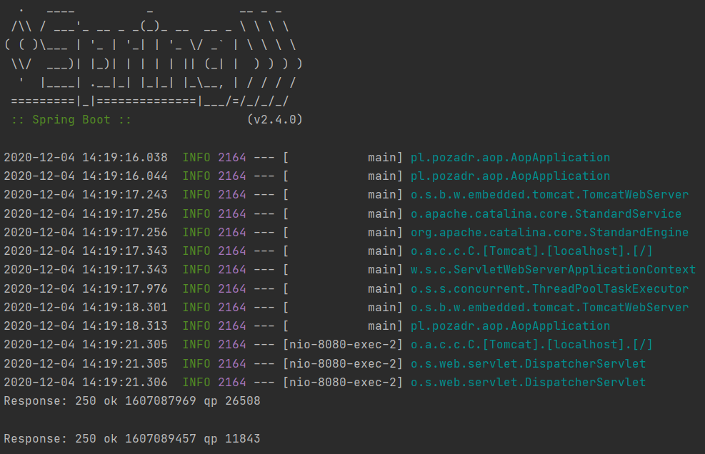

# AOP (Aspect Oriented Programming)
*Spring boot 2 academy*

## Task: 

Implement REST API using the "Movie" model. 

The API should have two endpoints implemented:
* GET all movies: http://localhost:8080/movies/all-movies
* POST movie (@RequestBody): http://localhost:8080/movies/add-movie
 After the POST, an email should be sent. Implementation has to use the AOP paradigm.

## Configuration

To be able to use the API, you have to add the configuration in the init file "application.properties".
 e.g.
 

    send-email.smtp_server=<smtp server>
    send-email.smtp_port=<port>
    send-email.username=<username>
    send-email.password=<password>
    send-email.email_from=<email from>
    send-email.email_to=<email to>

## Technologies

- Java 11
- Maven
- Spring Boot 2.4.0

## Screenshots

